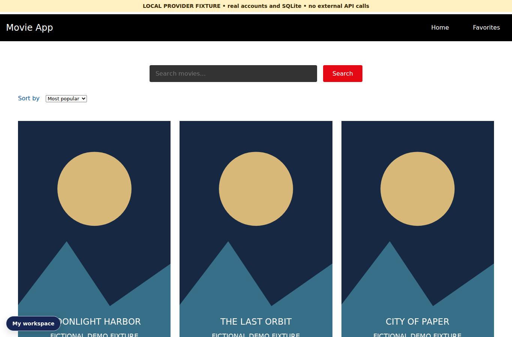
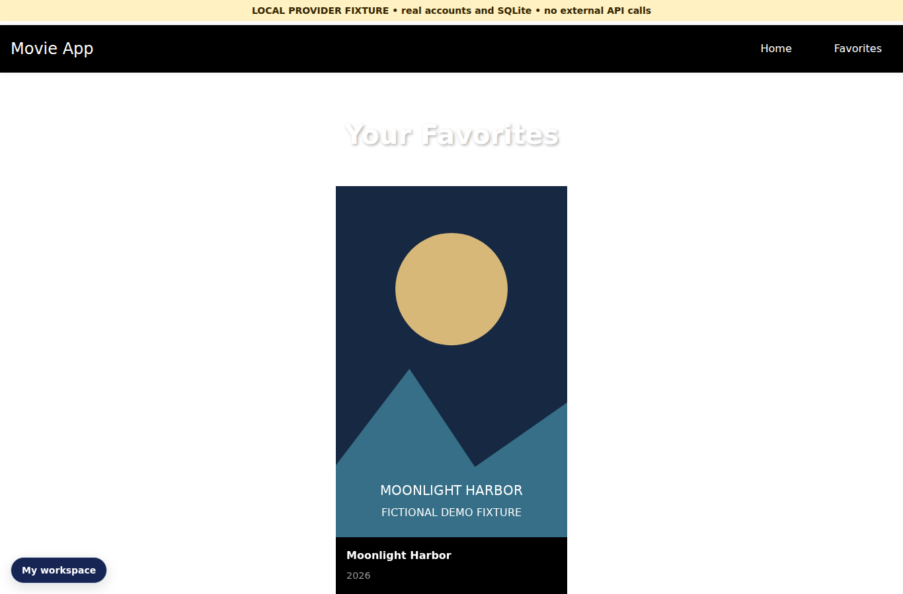

# Movie Explorer — discovery and account-backed favorites

Browse and search movie cards, inspect movie information, and keep a personal favorites collection. Provider requests go through the backend so the TMDB credential is not sent to the browser.

**Demo status:** Local full-stack app; screenshots/video use labeled provider fixtures. Live provider integration requires credentials.





[Watch the short local demo](docs/demos/walkthrough.mp4) · [Repeat the demo](docs/DEMO.md)

## Main workflow

Search a title → inspect the result → save a favorite → reopen Favorites after a refresh.

## Architecture and decisions

React 19 and Vite → Node.js 24 movie-provider proxy and account API → SQLite favorites. TMDB supplies movie discovery data when configured.

- The proxy allows specific movie routes, bounds pagination and applies a provider timeout.
- A movie ID can appear only once in an account’s favorites.
- The frontend displays loading and provider errors; saved favorites belong to the current account.

Accounts use salted scrypt password hashes and expiring HttpOnly sessions. The shared account/API foundation is reused across these portfolio applications; the domain behavior above is specific to this project.

## Run locally

Use Node.js 24. From this repository in PowerShell:

```powershell
npm ci
Copy-Item .env.example .env
# Edit .env: set TMDB_API_KEY for live discovery.
npm run build
npm run start:api
```

Open http://localhost:4000. Choose **Sign in · Account**, then **Create an account**. Use a password of 12–128 characters. The first account receives owner access; later accounts receive member access. Saved local data lives in the ignored `.data/` directory.

For live frontend development, run `npm run start:api` and `npm run dev` in separate terminals. Keep `.env` untracked.

## No-cost provider fixture mode

After installing dependencies and building the frontend, stop the normal server and run:

```powershell
node scripts/demo-fixtures.cjs
```

This uses a separate `.data/fixture-demo.sqlite` database and never calls the inference/movie provider. Create an account in this mode. Movie titles are fictional. The recording includes locally drawn poster fixtures; the launcher uses the app’s ordinary no-poster placeholder.

## Verification

```powershell
npm run test:api
```

The backend suite exercises account security and the application’s domain workflow. CI also runs lint and the frontend build. See [GitHub Actions](.github/workflows/fullstack.yml) and [backend reference](docs/backend.md). Capture details and their limits are recorded in [the demo guide](docs/DEMO.md).

## Limits

Live TMDB discovery requires a working backend credential. The recorded demo uses labeled local movie fixtures; it does not verify live provider access. A GitHub Pages/static preview cannot run this Node API.

Built and maintained by [Mustafa Sarwari](https://github.com/mustafa-sarwari). Existing source credits and licenses are preserved.
